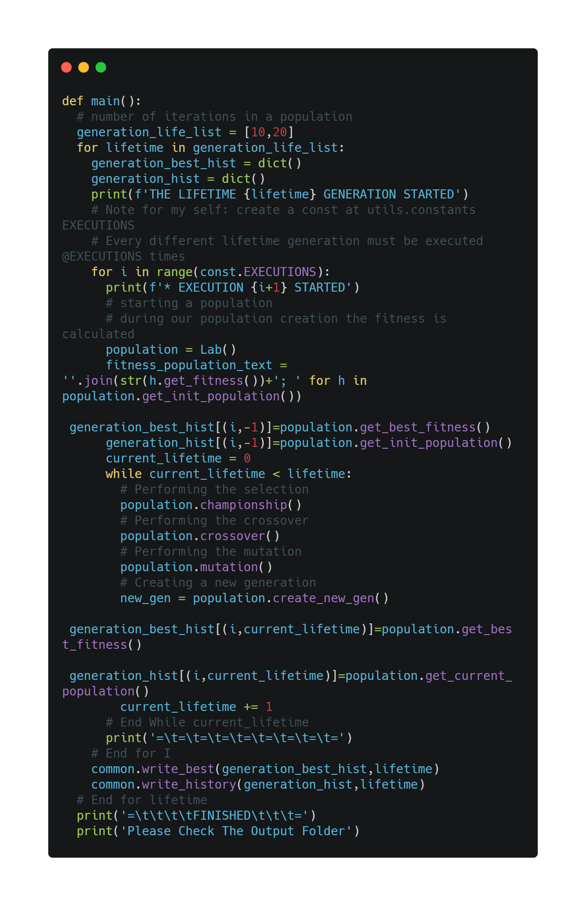

# Genetic Algorithm Function Minimize

## O Algoritmo
Os algoritmos genéticos se enquadram no ramo da computação evolucionária (CE), este ramo trabalha na solução de problemas por meio de uma abordagem inspirada em seleção natural, proposta por Darwin.

Algoritmos genéticos (AG) foram expostos John Holland em 1960, inicialmente a ideia foi apresentada para a realização de estudos de adaptação de espécies e seleção natural que ocorre no ambiente, juntamente com a ideia de transpor tais conceitos aos computadores.

Para que seja possível a implementação de um algoritmo genético é necessário que os seguintes pontos sejam seguidos:
* População inicial com presença de diversidade.
* Método de medição da adaptação de cada indivíduo.
* A presença de um manipulador para que seja possível combinar indivíduos para a criação de novos indivíduos na população.
* Critério de escolha de permanência na população e também sua retirada da população.
* A presença de um variante periódico nos indivíduos da população, a fim de manter a diversidade e expandir possibilidades.

Aplicando os requisitos expostos, é possível realizar a construção do algoritmo utilizando o fluxo apresentado na imagem a seguir


## Problema Proposto
O algoritmo deve ser capaz de minimizar o valor da função a seguir através do parâmetro X.


A imagem a seguir traz a representação gráfica da função exposta.


## Solução

### Linguagem Utilizada

Para a solução do problema proposto foi utilizada a linguagem Python, versão 3.8.7.

### Execução Codigo

O código foi criado utilizando suas informações de ambiente (tamanho de população, métricas e etc) utilizando um arquivo de constantes ```src/utils/constants.py```, desse modo a execução do código ocorre de maneira simplificada, necessário estar apenas na pasta raiz, fora da pasta src, e executar o comando na imagem abaixo


#### Alteração de Parâmetros

Os parâmetros utilizados em cada uma das funções requisito de um algoritmo genético  ([requisitos](https://github.com/elimarmacena/genetic_algorithm_minimize#o-algoritmo)) podem ser alteradas no arquivo ```src\utils\constants.py```, além desses parâmetros, também é possível alterar o tamanho da população e também o seed utilizado para os números randômicos.

### Saida Esperada

A execução do presente código resulta em 2 tipos de saídas, ambos os tipos estarão disponibilizadas na pasta ```output```. Como primeiro tipo teremos 2 arquivos contendo o melhor fitness de cada geração em sua respectiva interação, a nomenclatura para esse tipo de arquivo é lifetime{X}_best_entities.txt, onde {X} é o ciclo de vida utilizado. O segundo tipo se trata de um output de histórico, com todas as informações relacionadas a uma iteração de um determinado ciclo de vida, a nomenclatura para esse tipo de arquivo é iteration{X}_lifetime{Y}_historic.txt, onde {X} é a iteração utilizada e {Y} o ciclo de vida utilizado. Por fim temos 2 arquivos, um para cara ciclo de vida utilizado, contendo a média dos valores alcançados por cada geração nas iterações performadas, a sua nomenclatura é lifetime{X}_mean.txt, onde {X} é o valor do ciclo de vida utilizado para a manipulação.

### Implementação

#### Indivíduo (Subject)

Cada indivíduo presente na população é representado por um objeto do tipo **Subject**, como é mostrado na imagem a seguir, esse objeto possui 4 atributos, todos eles calculados no momento de sua criação.


O atributo **bit_list** é a representação binária de tal indivíduo, em nossa aplicação esse atributo é criado de maneira aleatória, é feito o uso de uma função para a tal criação, tendo o resultado esse valor é informado no momento da criação do objeto **Subject**. Conhecendo o atributo **bit_list** é realizado a atribuição dos demais atributos, **value** é determinado através de uma conversão simples de valores binários para valor decimal, já **x_value** é obtido utilizando o resultado de **value** atrelado à uma expressão matemática, tal expressão será exposta a seguir. Já o valor de **fitness** é obtido através da substituição do x na função apresentada no problema pelo o valor presente em **x_value**.


Onde β representa o número de bits presentes no atributo **bit_list**.

#### Geração (Lab)

A representação da população no presente código vem através da classe Lab, além de trazer o conceito de população para o código, a classe também contém os manipuladores necessários para o desenvolvimento de um algoritmo genético, sendo assim a classe núcleo da solução.

A classe apresenta 6 atributos, mas muitos desses atributos são gerados através de uma cadeia de execução. Primeiro temos **population_size**, esse atributo guarda o tamanho da população, ou seja, o número de indivíduos que fazem parte de uma população.

Ao instanciamos a classe, automaticamente é atribuído um valor para o atributo **init_population**, população inicial, essa população é gerada por meio de valores randômicos no array binário de representação do indivíduo (classe Subject). Temos também o atributo **current_population**, este atributo irá manter as gerações correntes a cada passo dado na criação de uma nova população.

Os demais atributos mostrados na imagem a seguir são gerados por meio de chamada de métodos da própria classe, que serão explicados melhor mais a frente.


##### Seleção

O problema proposto foi resolvido através de uma abordagem de seleção chamada campeonato, a sua ideia é bem simples, o número de "rounds" é equivalente ao tamanho da população, nesses rounds são selecionados um número N de indivíduos que irão "batalhar" entre si, o indivíduo que melhor se sair nessa batalha irá permanecer na população.

O conceito de melhor indivíduo pode variar por round, nem sempre o melhor valor significa o mais apto para população, às vezes o pior resultado pode ser mais interessante. Essa abordagem também nos auxilia a evitar uma construção de população com os melhores resultados e assim acarretando um cenário de máximos globais e diminuindo a variedade da população.

A implementação desse método no presente código pode ser visto a seguir.


##### Crossover

Após selecionados os indivíduos, partimos para a etapa de crossover, nessa etapa os indivíduos passam por um "novo processo de seleção" para estabelecer se será misturada as informações de dois indivíduos ou não.

Essa mistura pode ocorrer a partir de diferentes pontos do array de bits de um indivíduo, na solução desenvolvida foi utilizado a partição de 1 ponto, dessa maneira nós temos 50% de informação de cada indivíduo que foi selecionado para a mistura de informação. Essa mistura ocorre a partir de um determinada porcentagem estipulada, ou seja existe N% de dois indivíduos se misturam e geram um novo.

A implementação dessa fusão de informações é apresentada na figura a seguir e como pode ser visto, é utilizado os valores presentes no atributo **selected_population**, que é o atributo que mantém  a seleção realizada na [etapa de seleção](https://github.com/elimarmacena/genetic_algorithm_minimize#sele%C3%A7%C3%A3o) dos indivíduos.


##### Mutação

Visando manter o estado de variedade em uma população, os algoritmos genéticos fazem uso de mutação. Essa mutação nada mais é do que a alteração de valores presentes no array de representação de um indivíduo, assim como o crossover, essa abordagem precisa de uma determinada porcentagem para performar a mutação.

Em nosso código, como trabalhamos com valores binários no array de representação do indivíduo, a mutação trata apenas de uma inversão de bit. A implementação desse método é apresentado na imagem a seguir, cada bit do indivíduo deve ser analisado em uma porcentagem X de alteração, sendo assim possível haver apenas um bit alterado em todo o array do indivíduo.


##### Nova Geração
Após todos os processamentos em cima de uma população, o algoritmo genético deve dar origem a uma nova população, essa nova população pode ser composta de diferentes maneiras, mas na solução proposta foi feito o uso de elitismo.

A abordagem de elitismo ocorre quando uma parcela X dos melhores indivíduos da geração base, antes dos processamentos, é mantida para a nova geração e então afeita a agregação dos resultados de processamento juntamente com os dados "limpos".

No presente código é trabalhado uma população de tamanho 10, para o nosso elitismo foi estipulado 10% da população base deve ser mantida na próxima geração, ou seja 1 indivíduo, e os outros 9 indivíduos devem ser selecionados após o processamento da população base, no código optou-se por pegar os 9 melhores fitness da população. A implementação pode ser vista na imagem a seguir.


#### Arquivo da Aplicação(Main)

O arquivo de execução do codigo, main, possui uma construção simples, onde é seguido apenas a ordem dos requisitos estabelecidos para o funcionamento de um algoritmo genetico.

A imagem abaixo traz a função de execução, deste código podemos destacar o variável **generation_life_list**, onde temos uma lista contendo o tempo de vida (total máximo gerações) que uma população deve ter. Após isso trazemos o destaque para o loop baseado em **const.EXECUTIONS**, valor utilizado para estabelecer a quantidade de vezes que um mesmo ciclo de vida deve ser executado, esse valor também pode ser alterado no arquivo de constantes, juntamente com os demais valores presentes no arquivo.



Levantado os pontos iniciais, a ordem de execução é bem simples, tarefas básicas de algoritmo genético ocorrem e suas saídas são salvas em arquivos. Vale salientar que as gerações escritas no arquivo com o valor -1 representam a geração inicial.


## Resultados

Apesar de toda a teoria por trás do funcionamento dos algoritmos genéticos, as saídas encontradas no problema proposto foram relativamente simples e fáceis de levantar uma análise breve.

O pico de melhores fitness foi encontrado nas gerações 9 e 10, utilizando os ciclos de vida de 10 e 20 gerações. Os melhores resultados de cada interação em cada ciclo de vida pode ser encontrado em [Ciclo 10](/outputs/lifetime10_best_entities.txt) e [Ciclo 20](/outputs/lifetime20_best_entities.txt). Vale lembrar que os valores alcançados podem variar com o uso de seed para os números randômicos.

Também através dos valores médios calculados podemos ver uma crescente de melhoria e logo após um ponto de estabilização, isso pode ser visto tanto quanto no ciclo de 10 gerações quanto no ciclo de 20, nesse segundo ciclo é possível notar um processamento desnecessário, uma vez que a partir da 11 geração não ocorre melhorias nos resultados alcançados.

Mais informações relacionadas a média dos valores alcançados podem ser vistos a seguir nos gráficos, 10 e 20 gerações respectivamente.

